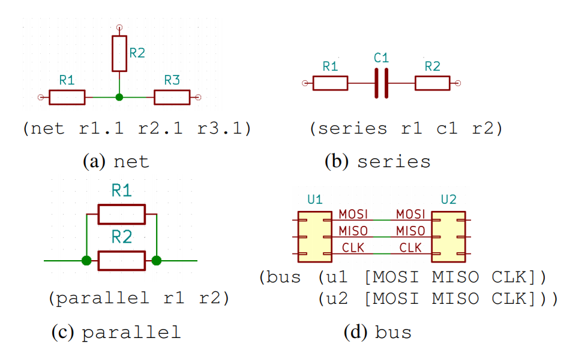
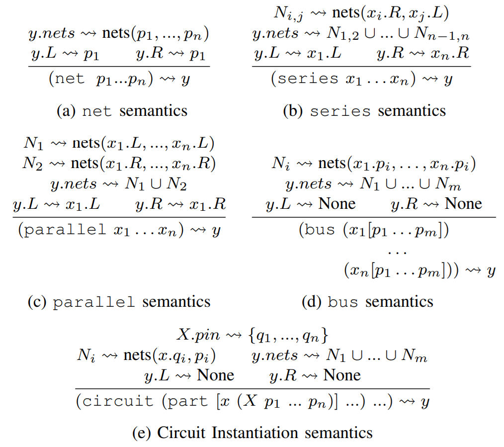

# API

## A (formal) overview of syntax

### The syntax


### The semantics



---



## Grow your circuit with`make-circuit`

This syntax makes it easy to define a composite. The syntax is:

```racket
(make-circuit
  #:external-pins (o1 o2)
  #:vars ([a (R 22)]
          [b (C 1)]
          [c (crystal)])
  #:connect (*- self.o1 a b c self.o2)
  #:layout (hc-append a b c))
```

This declares a circuit, with external pins named `o1` and `o2` respectively. It
contains a resistor, a capacitor, and a crystal, lined together linearly. In the
meantime, the physical layout is defined as horizontally append the three
components.

To make the circuit capable of using line connection syntax, define the `left`
and `right` external pins and connect accordingly. E.g.

```racket
(define (Switch)
  (make-circuit
   #:vars ([it (SKRPACE010)])
   #:external-pins (left right)
   #:layout it
   #:connect (list (*- self.left it.A1)
                   (*- self.right it.B1))))
```

### Connection syntax and semantics

Composing circuit is the process of combining smaller circuits and atoms with
netlist. There are 4 syntax for composing Composites. The return value is a
Composite that contains the used components, and the external pin for the
returned Composite is denoted as `out.X`.

The line connection:

```lisp
(*- a b c)
```

Results in the netlist:

```
out.1 -- a.1
a.2 -- b.1
b.2 -- c.1
c.2 -- out.2
```

The split connection:

```lisp
(*< a b c)
```

results in the netlist:

```
out.1 -- a.1 -- b.1 -- c.1
out.2 -- a.2 -- b.2 -- c.2
```

The vectorized connection:

```lisp
(*= (a [p1 p2 p3])
    ([b.p1 c.p2 d.p3]))
```

results in the netlist:

```
a.p1 -- b.p1
a.p2 -- c.p2
a.p3 -- d.p3
```

Note that the vector supports two slightly different syntax: the component can
be write once. I.e. `(a [1 2 3])` is equivalent to `([a.1 a.2 a.3])`.

And finally the netlist syntax:

```lisp
(*+ ([a.1 b.1 c.1]
     [a.2 b.3]))
```

results in the netlis:

```
a.1 -- b.1 -- c.1
a.2 -- b.3
```

### Layout co-design

The layout is inspired by [racket's functional picture
library](https://docs.racket-lang.org/pict/). The following combinators are
provided:

The `*-append` family of functions append its arguments horizontally or
vertically:

```
vl-append
vc-append
vr-append
ht-append
hc-append
hb-append
htl-append
hbl-append
```

The `*-superimpose` family of functions overlap its arguments.

```
lt-superimpose
lb-superimpose
lc-superimpose
ltl-superimpose
lbl-superimpose
rt-superimpose
rb-superimpose
rc-superimpose
rtl-superimpose
rbl-superimpose
ct-superimpose
cb-superimpose
cc-superimpose
ctl-superimpose
cbl-superimpose
```

You can also rotate or pin-over at a absolute location in terms of (x,y)
coordinates:

```racket
(rotate item 3.14)
(pin-over base dx dy item)
```

## Visualization and exporting

The layout can be visualized via

```racket
(show-layout my-circuit)
```

To export KiCAD files, use `circuit-export`:

```racket
(circuit-export fitboard
                #:auto-place #t
                #:formats '(kicad pdf dsn ses))
```

The arguments:

- `#:auto-place` determins whether to run placement engine. This requires a backend
  placement engine running on specific port (by default 8082)
- `#:formats`: this is a list of export formats
  - kicad: kicad_pcb file
  - pdf
  - dsn: Spectre DSN
  - ses: run freerouting on dsn. This requires dsn is exported, freerouting.jar
    executable can be found, and you are running a GUI session so that the
    freerouting.jar window can pop up (which means it cannot run in jupyter
    notebook)
